# Set up a Fleet

## Introduction

This lab walks you through the steps to set up a new fleet in Java Management Service (JMS).

Estimated Time: 5 minutes

### Objectives

In this lab, you will:

* Set up a Fleet using the Java Management Service user interface
* Download the installation script to be used in [Lab 5: Install Management Agent on your Managed Instances](?lab=set-up-of-management-agent)

### Prerequisites

* You have signed up for an account with Oracle Cloud Infrastructure and have received your sign-in credentials.
* You are using an Oracle Linux image on your Managed Instance for this workshop.

## Task 1: Set Up Java Management Service Fleet

1. In the Oracle Cloud Console, open the navigation menu, click **Observability & Management**, and then click **Fleets** under **Java Management**.

  

2. Select the compartment created for JMS resources in Lab 1 (Compartment name should be **Fleet_Compartment**) and **Create fleet**.

  

3. In the Create fleet dialog box, enter a name for the Fleet Name (for example, `fleet-1`), and a description.

4. Click **Select all advanced features**.

  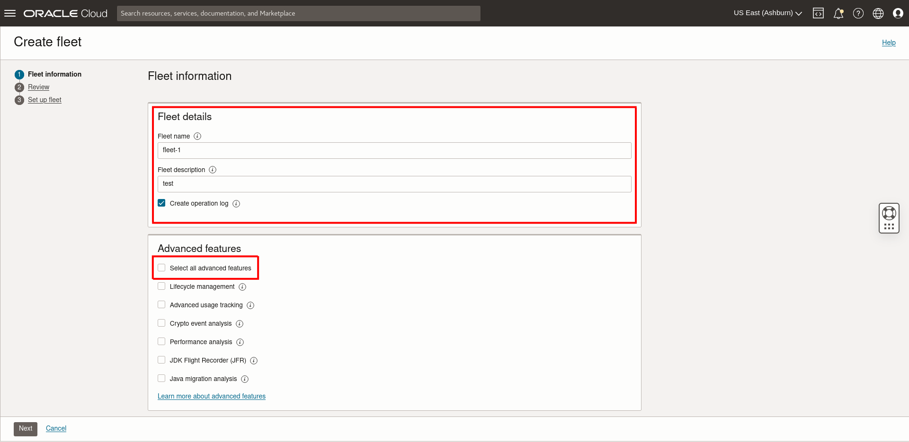

  Click **Agree**. This is to enable all the advanced features. You can still edit it after the fleet is created.

  

  There are 6 different advanced features available:
     * Lifecycle management (LCM) - Manage the lifecycle of Java runtimes in your fleet by installing or removing reported Java runtime.
     * Advanced usage tracking - Gain advanced insights into your Java workloads in the fleet by tracking application server, Oracle JDK and openJDK used by applications.
     * Crypto event analysis - Assess the impact of Oracle JRE and JDK Cryptographic roadmap on the applications running in your fleet.
     * Performance analysis - Evaluates applications and provides customized recommendations to improve performance.
     * JDK Flight Recorder (JFR) - Collect information about events in the application running in your fleet using JDK Flight Recorder (JFR), a tool for collecting diagnostic and profiling data about a running Java application.
     * Java migration analysis - Assists in migrating applications from older JDK versions to newer JDK version by providing a detailed analysis that helps to assess the potential efforts and risks of migration.


  To learn more about the advanced features, see [Using Java Management Service Advanced Features](https://apexapps.oracle.com/pls/apex/dbpm/r/livelabs/view-workshop?wid=3202).

  

5. Click **Next**. You are prompted to review the fleet information and management agent configuration. If you wish to modify your choices, click **Previous**.

6. Click **Create**. This creates a new fleet and its configuration.

  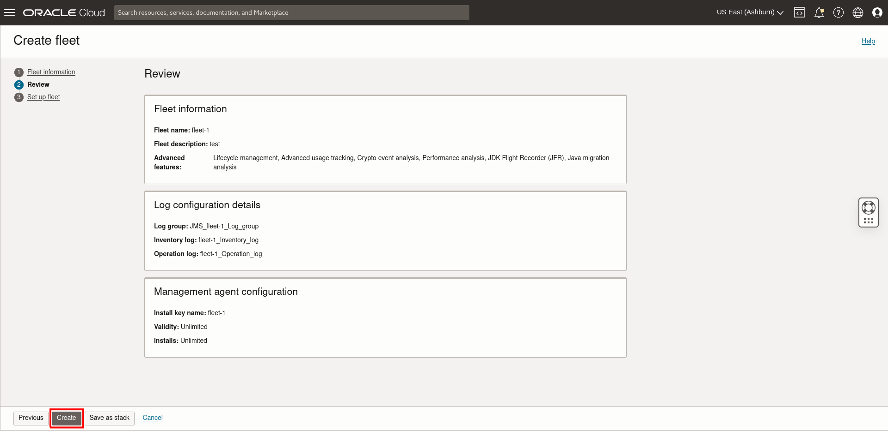

7. Click **Download software and installation script**.

  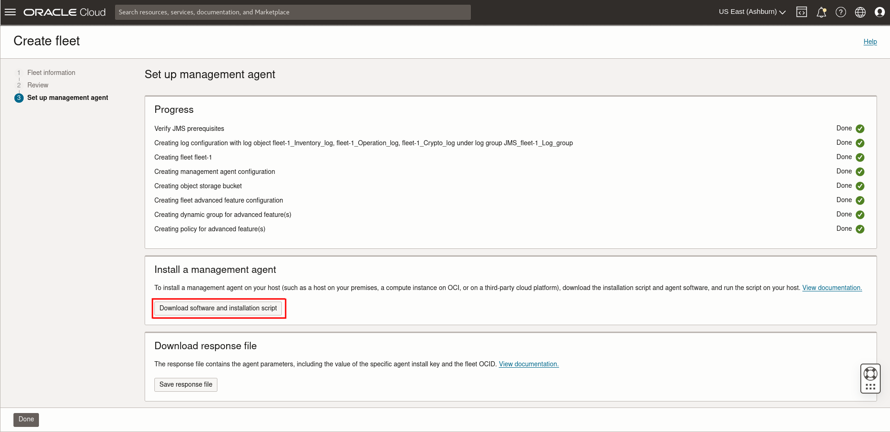

  Select an appropriate version of the management agent software according to the operating system on your instance(s).

  Select an appropriate version of the installation script according to the operating system on your instance(s).

  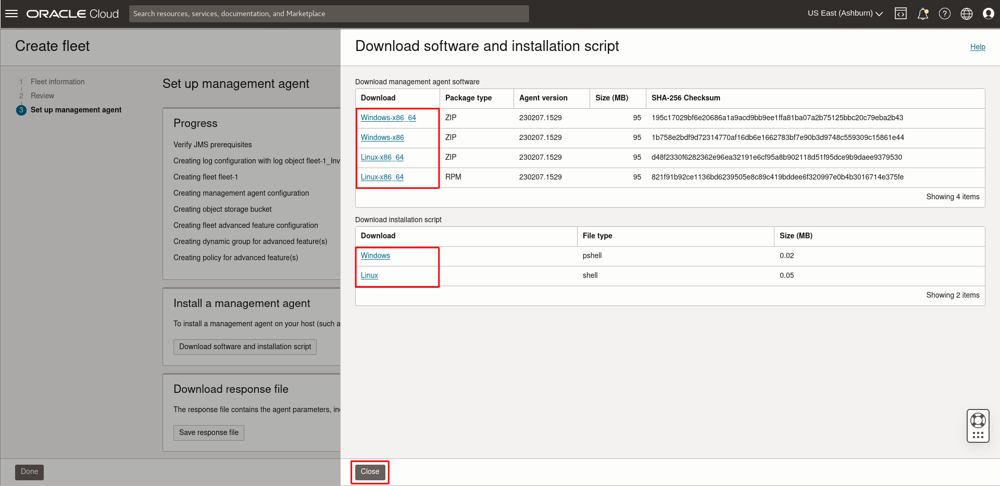

  Click **Close** and **Done** once the download is complete. The downloaded file will be used in [Lab 5: Install Management Agent on your Managed Instances](?lab=set-up-of-management-agent) to install the Management Agent. You can still download the installation script after the fleet is created.

  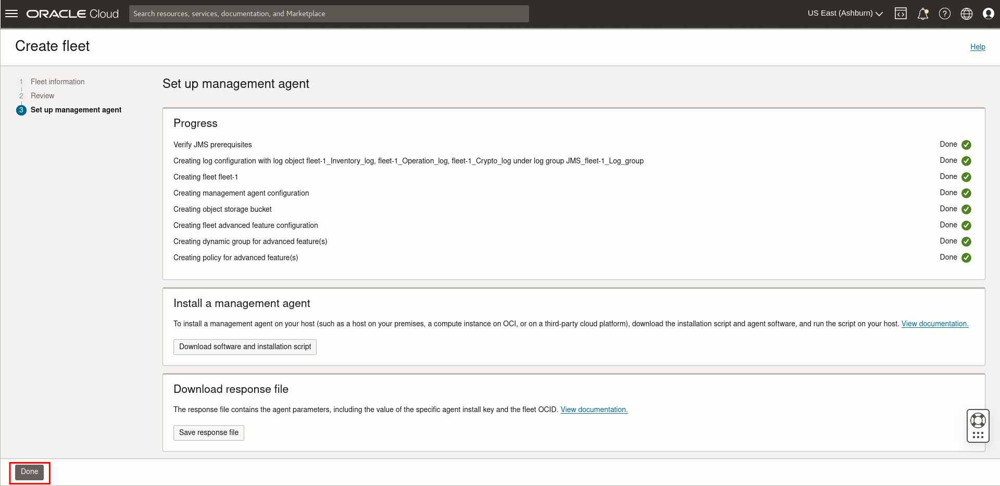

8. After JMS is linked to the management agent, it will collect information on your Java runtimes. As the management agent scans the instance periodically, the information may not appear immediately. The scanning frequency can be changed here.

9. Click the fleet. In the detail page, click **Modify agent settings**.

  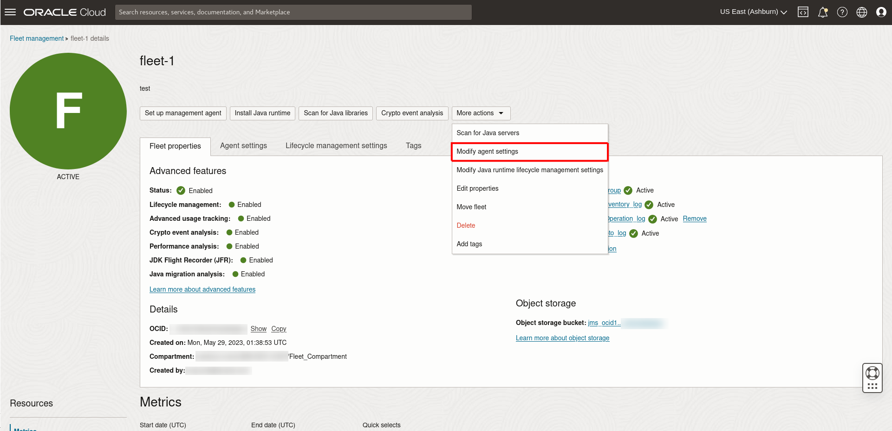

10. Change the **Java Runtime Usage**, **Agent Polling Interval**, **Work Request Validity** and  **Java Runtime Discovery** to the desired value. 

    **Java Runtime Usage**: How frequent agents reports Java usage. 

    **Agent Polling Interval**: How frequent which agents check for work request to execute.
 
    **Work Request Validity**: The time period for accepting the work request by the agents involved.

    **Java Runtime Discovery**: How frequent agents scan for Java installation.

  For this example, change **Java Runtime Discovery** to **3 hours**, and **Java Runtime Usage** to **5 minutes**.

  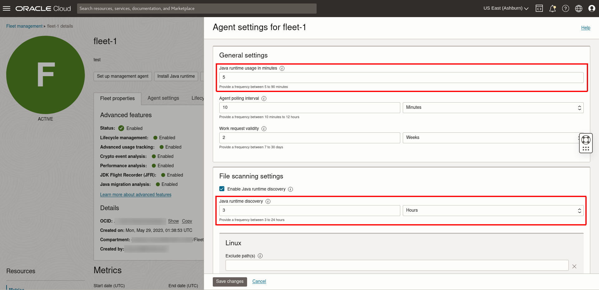

11. Click **Save changes** to save the new setting.

  


## Task 2: Verifying policies and Dynamic Groups required for advanced features
1. This task will verify the creation of the policies and Dynamic Groups required for the advanced features when advanced features was enabled during the fleet creation.

2. Navigate to the Dynamic Groups page.

    * In the Oracle Cloud Console, open the navigation menu and click **Identity & Security**. Under **Identity**, click **Domains**.
        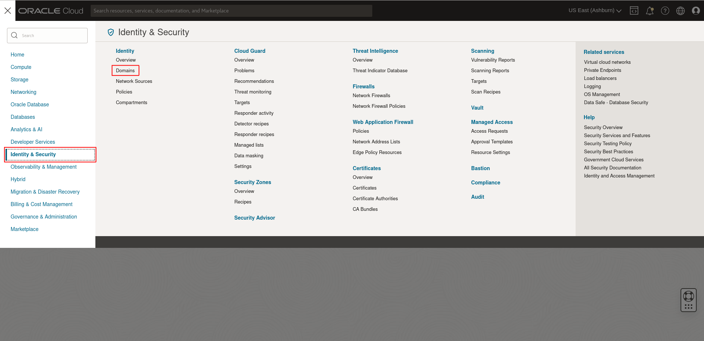
        
    * In the Domains page, click **Default**.
        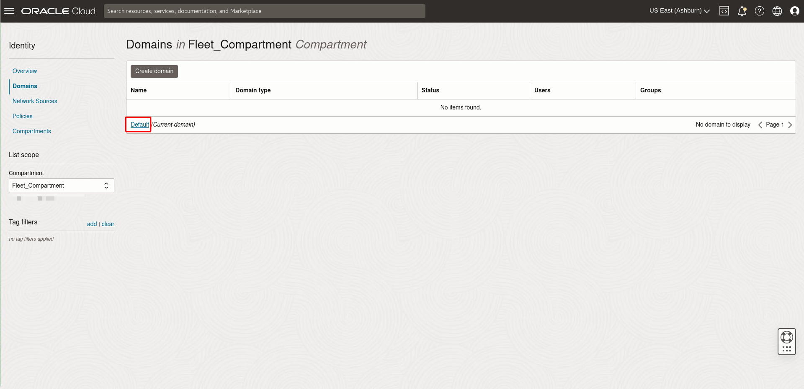
        
    * In the Overview page, click **Dynamic groups**.
        
        

3. There will be 2 additional dynamic groups created. 
    * **JMS\_Advanced\_Features\_MACS_GROUP** with 2 Matching Rules
    * **JMS\_Advance\_Features\_INSTANCE_PRINCIPALS\_GROUP** with 1 Matching Rule

   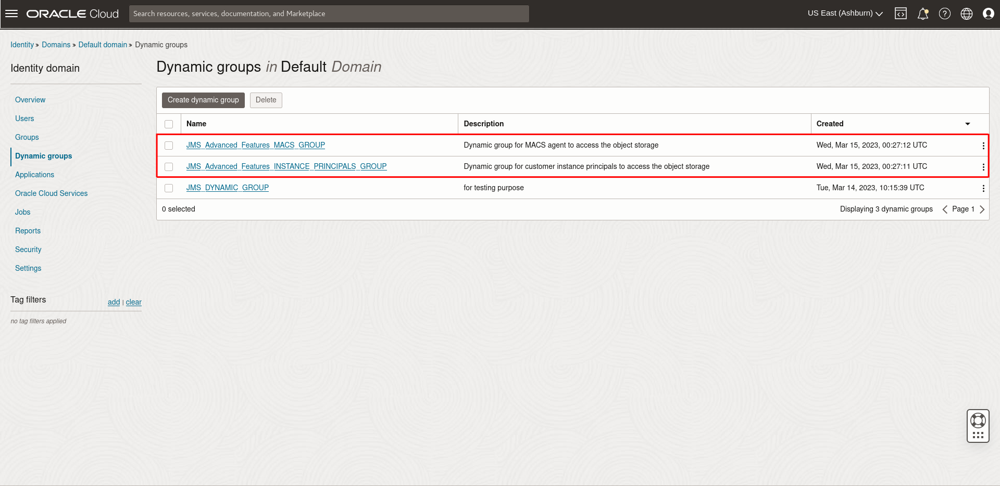

   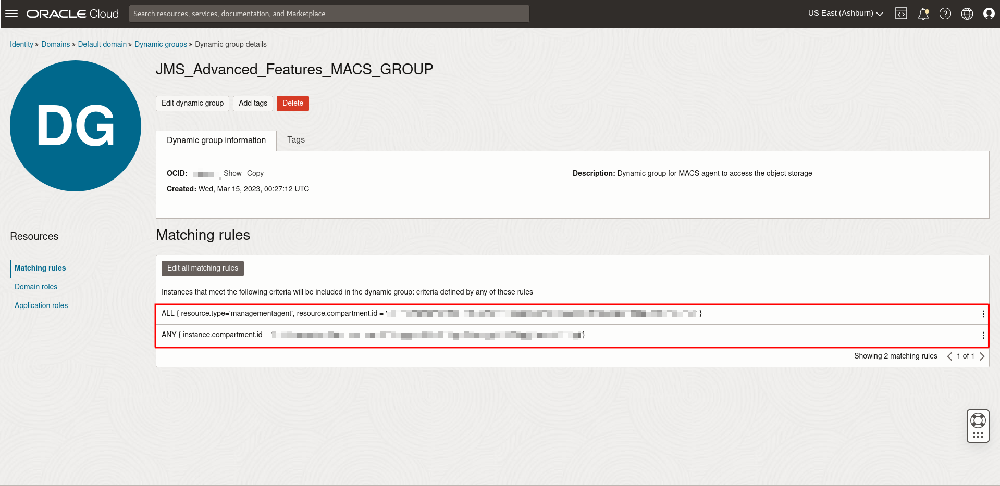

   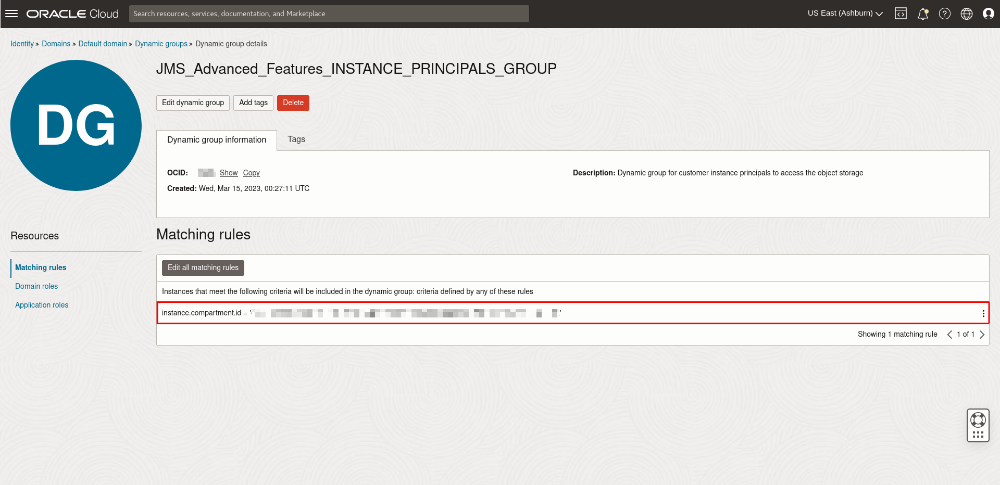

4. Click on **Identity** to navigate to the Identity page.

  

5. On the Identity page, click on **Policies** from the Identity menu on the left.

  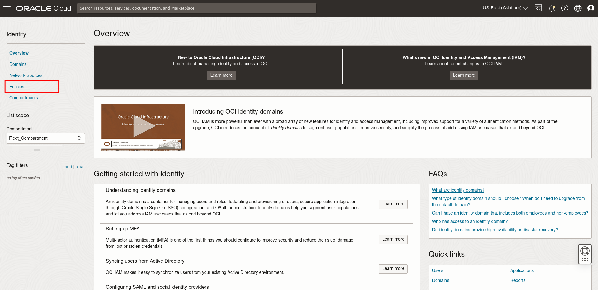

6. Select the compartment where the fleet was created in Task 1 (Compartment name should be **Fleet_Compartment**). You should see the policy name **JMS-Advanced-Features**. Click on the policy name **JMS-Advanced-Features**.

  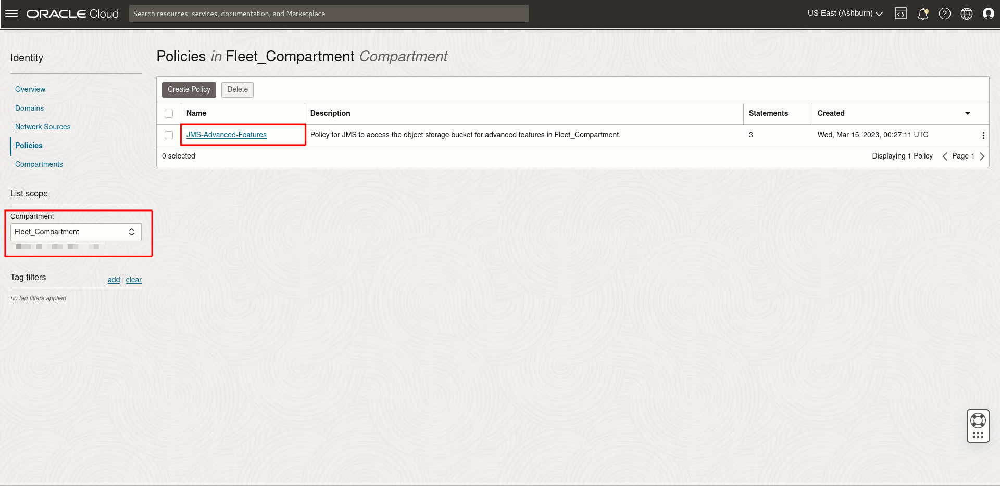

6. The **JMS-Advanced-Features** policy contains 3 policy statements.

    ```
    <copy>
    ALLOW dynamic-group JMS_Advanced_Features_INSTANCE_PRINCIPALS_GROUP to MANAGE object-family in compartment Fleet_Compartment
    ALLOW dynamic-group JMS_Advanced_Features_MACS_GROUP to MANAGE objects in compartment Fleet_Compartment
    ALLOW resource jms server-components to MANAGE object-family in compartment Fleet_Compartment
    </copy>
    ```

    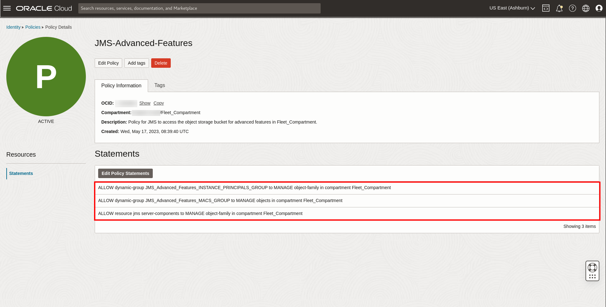
  

## Task 3: Understanding the Oracle Cloud Infrastructure Services which Java Management Service leverages on

JMS also tap on the following OCI services to generate logs, object storage information and monitoring metrics of the fleet for the users to view. These are the details of these services:

1. Logging Service
  
    - These logs are event logs contributed by Java Management Service and by the service plugins deployed on the management agent of the host machine.

    - All the different log objects will belong to the fleet log group.

    - Each log object will contain its own category of logs e.g. Inventory log will contain logs of the scanning of Java installations in the Managed Instance.

    - Note that the Inventory log is crucial as a fleet cannot be successfully created without it.

    To access the fleet logs, you may click on the respective log object displayed on the fleet main page.

    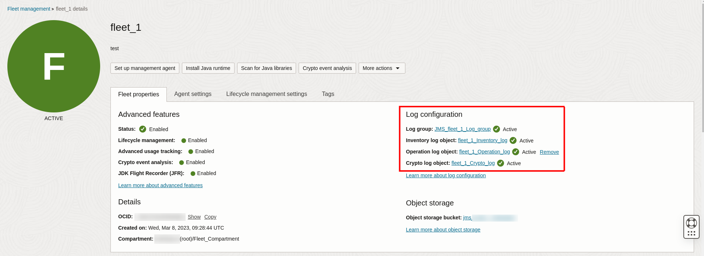

    To view the logs in detail, click on the drop down arrow.

    

    You should be able to see the details of the log.

    

    - See [Logging in JMS](https://docs.oracle.com/en-us/iaas/jms/doc/appendix.html#GUID-559AECF8-4FAD-45CC-AE3B-69CA0DC9BDDD) to learn more details about the logs managed by JMS.

2. Object Storage Service

    - This is required for JMS advanced features, such as JDK Flight Recording (JFR) and Crypto event analysis, where the recordings are uploaded to object storage before JMS retrieves the recording to perform crypto event analysis. The resulting analysis report is then uploaded to object storage.

    - The object storage bucket serves as the storage for resources such as JFR files and analysis reports.

    To access the object storage associated with the fleet, click on the object storage bucket link.

    

    Scroll down the object storage bucket details page.

    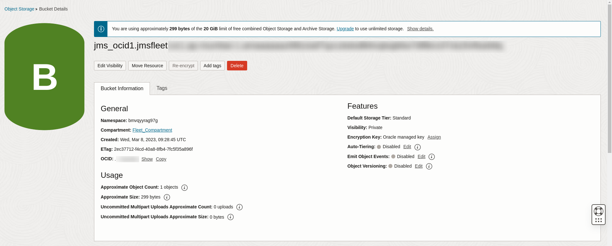

    You should be able to see the objects created by JMS advanced features, such as analysis reports.

    

    - See [Object Storage Overview](https://docs.oracle.com/en-us/iaas/Content/Object/Concepts/objectstorageoverview.htm) to read more about object storage service.

3. Monitoring Metrics Service

    - This service processes the information generated by JMS and displays it as graphs of Managed Instances, Java runtimes and applications.

    - You may create your own alarms for notifications based on these metrics.

    You may view the fleet metrics on the fleet overview page, by clicking **Metrics** under Resources.

    

    - See [Java Management Metrics](https://docs.oracle.com/en-us/iaas/jms/doc/appendix.html#GUID-E7908768-AE97-4BB9-85CB-17A1BD87A271) to learn more about metrics in JMS.


You may now **proceed to the next lab**.


## Troubleshoot fleet creation issues

If you encounter any errors similar to the following, please check policy statements in your root compartment:

**For Task 1 Step 6: Create fleet**

    ```
    <copy>
    ALLOW GROUP <user_group> TO MANAGE fleet IN COMPARTMENT <compartment_name>
    ALLOW GROUP <user_group> TO MANAGE tag-namespaces IN TENANCY
    ALLOW GROUP <user_group> TO MANAGE log-groups IN COMPARTMENT <compartment_name>
    ALLOW GROUP <user_group> TO MANAGE log-content IN COMPARTMENT <compartment_name>
    ALLOW GROUP <user_group> TO MANAGE management-agents IN COMPARTMENT <compartment_name>
    ALLOW GROUP <user_group> TO MANAGE management-agent-install-keys IN COMPARTMENT <compartment_name>
    ALLOW GROUP <user_group> TO MANAGE dynamic-groups IN TENANCY
    ALLOW GROUP <user_group> TO MANAGE policies IN COMPARTMENT <compartment_name>
    ALLOW GROUP <user_group> TO READ metrics IN COMPARTMENT <compartment_name>
    ALLOW GROUP <user_group> TO READ instance-agent-plugins IN COMPARTMENT <compartment_name>
    </copy>
    ```

**Fleet state failed**

    ```
    <copy>
    ALLOW resource jms server-components TO MANAGE log-groups IN COMPARTMENT <compartment_name>
    ALLOW resource jms server-components TO MANAGE log-content IN COMPARTMENT <compartment_name>
    ALLOW resource jms server-components TO USE management-agent-install-keys IN COMPARTMENT <compartment_name>
    ALLOW resource jms server-components TO MANAGE metrics IN COMPARTMENT <compartment_name> WHERE target.metrics.namespace='java_management_service'
    ALLOW resource jms server-components TO READ instances IN tenancy
    ALLOW resource jms server-components TO INSPECT instance-agent-plugins IN tenancy
    </copy>
    ```

## Learn More

* Refer to the [Fleet Management](https://docs.oracle.com/en-us/iaas/jms/doc/fleet-management.html) section of the JMS documentation for more details.

* Use the [Troubleshooting](https://docs.oracle.com/en-us/iaas/jms/doc/troubleshooting.html#GUID-2D613C72-10F3-4905-A306-4F2673FB1CD3) chapter for explanations on how to diagnose and resolve common problems encountered when installing or using Java Management Service.

* If the problem still persists or it is not listed, then refer to the [Getting Help and Contacting Support](https://docs.oracle.com/en-us/iaas/Content/GSG/Tasks/contactingsupport.htm) section. You can also open a support service request using the **Help** menu in the OCI console.


## Acknowledgements

* **Author** - Esther Neoh, Java Management Service
* **Last Updated By** - Ivan Eng, May 2023
