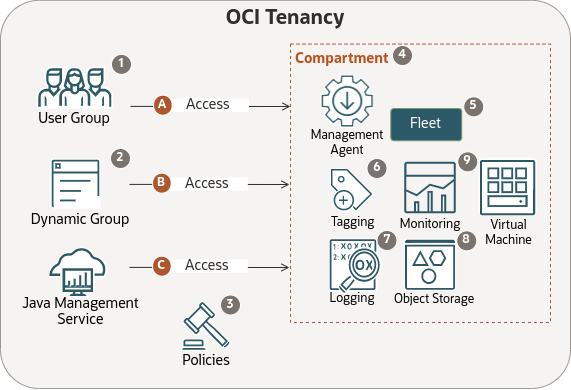

# Understand concepts related to Oracle Cloud Infrastructure Resources and Services for Java Management Service

## Introduction

This lab walks you through key concepts that need to be understood before setting up your Oracle Cloud Infrastructure (OCI) environment for Java Management Service (JMS).

Estimated Time: 30 minutes

### Objectives

In this lab, you will:

- Learn about the important concepts regarding OCI resources in preparation for setting up the OCI environment for JMS to operate. These OCI resources include compartment, tag, user group, dynamic group, policies and fleet.
- Understand the relationships between these OCI resources and services, including logging, metrics and object storage, and how JMS leverages these relationships to allow you to observe and manage Java SE usage in your enterprise.

## Task 1: Understand concepts related to Oracle Cloud Infrastructure Resources and Services for Java Management Service

Before the set up of Oracle Cloud Infrastructure (OCI) resources and services for Java Management Service (JMS), it is important to understand the concepts behind them and how JMS taps on them to operate.

This diagram illustrates the purpose of OCI resources and services in JMS with details of each resource and service explained below:



1. User Group:

    - See [Managing Groups](https://docs.oracle.com/en-us/iaas/Content/Identity/groups/managinggroups.htm) for its definition and details.
    - Certain policies are applied to the user group, such as "Fleet Managers", to allow these users to manage OCI resources and services required in JMS, such as creating a fleet and managing tag namespaces.

2. Dynamic Group:

    - See [Managing Dynamic Groups](https://docs.oracle.com/en-us/iaas/Content/Identity/dynamicgroups/managingdynamicgroups.htm) for its definition and details.
    - The creation of a dynamic group is important as it allows for policies to be applied to the group of compute instances and management agents, to allow them to communicate information back to the fleet through OCI service endpoints.

3. Policies:

    - See [How Policies Work](https://docs.oracle.com/en-us/iaas/Content/Identity/policieshow/how-policies-work.htm) for its definition and details.
    - To enable basic features, policies are applied to three categories:

        A. User group "FLEET\_MANAGERS":
        ```
        <copy>
        ALLOW GROUP FLEET_MANAGERS TO MANAGE fleet IN COMPARTMENT Fleet_Compartment
        ALLOW GROUP FLEET_MANAGERS TO MANAGE management-agents IN COMPARTMENT Fleet_Compartment
        ALLOW GROUP FLEET_MANAGERS TO MANAGE management-agent-install-keys IN COMPARTMENT Fleet_Compartment
        ALLOW GROUP FLEET_MANAGERS TO MANAGE tag-namespaces IN TENANCY
        ALLOW GROUP FLEET_MANAGERS TO MANAGE instance-family IN COMPARTMENT Fleet_Compartment
        ALLOW GROUP FLEET_MANAGERS TO MANAGE log-groups IN COMPARTMENT Fleet_Compartment
        ALLOW GROUP FLEET_MANAGERS TO MANAGE log-content IN COMPARTMENT Fleet_Compartment
        ALLOW GROUP FLEET_MANAGERS TO READ METRICS IN COMPARTMENT Fleet_Compartment
        ALLOW GROUP FLEET_MANAGERS TO READ instance-agent-plugins IN COMPARTMENT Fleet_Compartment
        </copy>
        ```

        These policy statements allow users in this user group to work with JMS such as creating a fleet, creating required tag, reading information about fleet and installing management agent on the instance.

        B. Dynamic group "JMS\_DYNAMIC\_GROUP":
        ```
        <copy>
        ALLOW DYNAMIC-GROUP JMS_DYNAMIC_GROUP TO MANAGE management-agents IN COMPARTMENT Fleet_Compartment
        ALLOW DYNAMIC-GROUP JMS_DYNAMIC_GROUP TO MANAGE instances IN COMPARTMENT Fleet_Compartment
        ALLOW DYNAMIC-GROUP JMS_DYNAMIC_GROUP TO MANAGE log-content IN COMPARTMENT Fleet_Compartment
        ALLOW DYNAMIC-GROUP JMS_DYNAMIC_GROUP TO USE tag-namespaces IN TENANCY
        ALLOW DYNAMIC-GROUP JMS_DYNAMIC_GROUP TO USE METRICS IN COMPARTMENT Fleet_Compartment
        </copy>
        ```

        These policy statements allow compute instances and management agents in this dynamic group to communicate information to OCI.

        C. Service "javamanagementservice":
        ```
        <copy>
        ALLOW SERVICE javamanagementservice TO MANAGE log-groups IN COMPARTMENT Fleet_Compartment
        ALLOW SERVICE javamanagementservice TO MANAGE log-content IN COMPARTMENT Fleet_Compartment
        ALLOW SERVICE javamanagementservice TO MANAGE metrics IN COMPARTMENT Fleet_Compartment WHERE target.metrics namespace='java_management_service'
        ALLOW SERVICE javamanagementservice TO READ instances IN tenancy
        ALLOW SERVICE javamanagementservice TO INSPECT instance-agent-plugins IN tenancy
        ALLOW SERVICE javamanagementservice TO USE management-agent-install-keys IN COMPARTMENT Fleet_Compartment
        </copy>
        ```

        These policy statements allow JMS to work with services including monitoring metrics, logs in the fleet.

    When advanced features are enabled during the fleet creation, additional dynamic groups and policies would be automatically created in OCI.
    This allows JMS, the management agents and the compute instances to access object storage in the fleet for uploading of information such as crypto event analysis report and JDK Flight Recording data.

4. Compartment:

    - See [Managing Compartments](https://docs.oracle.com/en-us/iaas/Content/Identity/compartments/managingcompartments.htm) for its definition and details.

    - A compartment can contain many JMS related resources such as fleets, managed instances, management agents, jms tag namespace with tag definition, logs, object storage and monitoring metrics.

5. Fleet:

    - A fleet is the primary collection with which you interact when using JMS. It contains Managed Instances that share rules and policies. See [Managed Instance](https://docs.oracle.com/en-us/iaas/jms/doc/getting-started-java-management-service.html#GUID-141F2F39-8078-481A-ACE7-65792E314ABB) for the definition of a Managed Instance.

    - It is created in a compartment and contain information about the Managed Instances such as logs, object storage and monitoring metrics.

6. Tag and tag namespace:

    - See [Managing tags and tag namespaces](https://docs.oracle.com/en-us/iaas/Content/Tagging/Tasks/managingtagsandtagnamespaces.htm) for its definition and details.

    - For JMS to operate, a specific tag key with the tag key definition '**fleet\_ocid**' has to be created in a specific tag namespace '**jms**' in the **root compartment**. This allows each management agent to be tagged with defined tags jms.fleet_ocid and tag value "ocid1.jmsfleet....." of the specific fleet it is associated with, after the management agent is installed on the Managed Instances.

    - With the tag link, these agents can send data back to the fleet in OCI, which JMS can process and manage. Users can then observe and monitor the Java related data e.g. usage tracking associated with each Managed Instance.

You may now **proceed to the next lab.**

## Learn More

* Refer to the [Getting Started with Java Management Service](https://docs.oracle.com/en-us/iaas/jms/doc/getting-started-java-management-service.html) for more details.

## Acknowledgements

- **Author** - Sherlin Yeo, Java Management Service
- **Last Updated By** - Sherlin Yeo, May 2023
